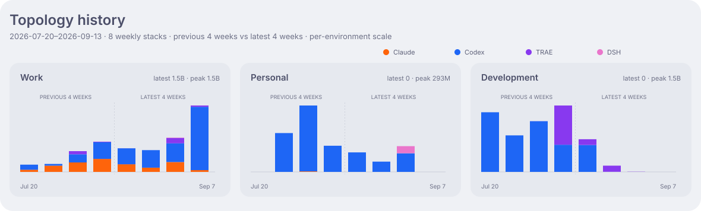
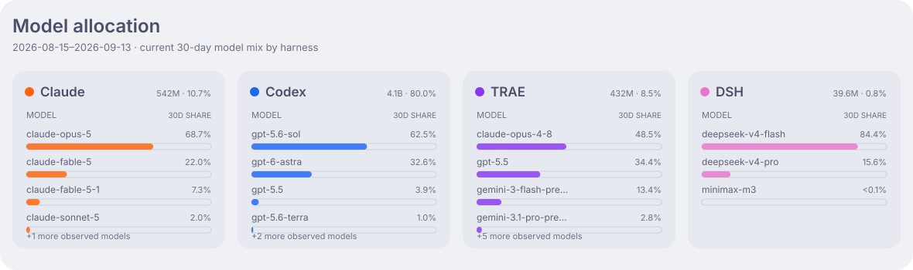
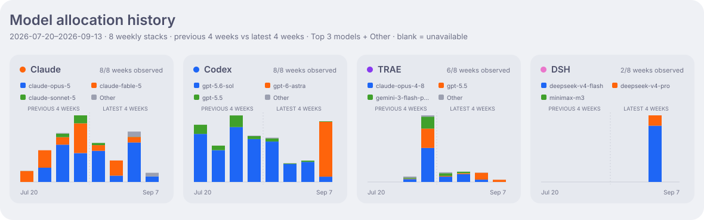
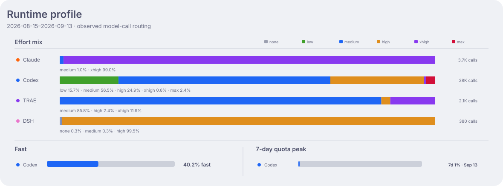
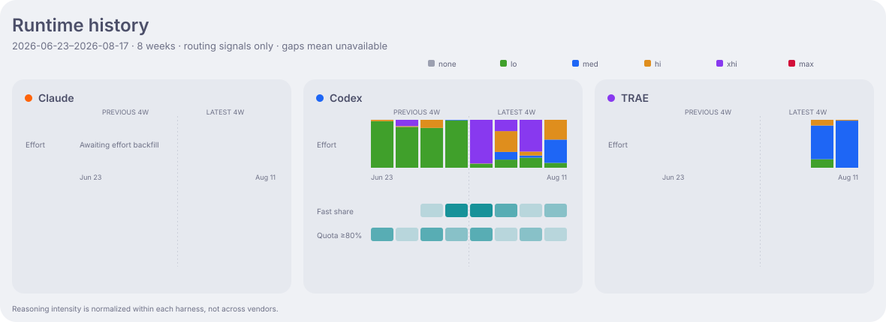

<h1 align="center">Aether Ledger</h1>

<p align="center">
  The AI compute ledger of the <strong>Nightglass Protocol</strong> —
  an anonymized, continuously updated record of how my coding agents spend tokens.
</p>

<p align="center">
  English · <a href="README_zh-CN.md">简体中文</a>
</p>

<p align="center">
  <a href="https://github.com/kyriekevin/Aether_Ledger/actions/workflows/verify.yml"></a>
  <a href="LICENSE"></a>
  
</p>

> [!IMPORTANT]
> Public by design. The ledger keeps anonymized aggregates only — no prompts, sessions,
> repository names, hostnames, usernames, or working directories are ever recorded.

Aether Ledger records how I use Claude Code, Codex, and TRAE CLI—and makes that activity visible.
Historical OpenCode-launched usage remains in the ledger as a legacy harness bucket.
Tokens are not skill points; they are the compute resources I spend while turning ideas into
useful work.

## Activity


Costs are API-equivalent estimates based on the captured model usage, not an actual subscription
bill. Active days count every calendar day with a positive token total.

## Topology




Topology shows which active agents serve each public environment over the latest 30 days.
The history view compares the previous four weeks with the latest four weeks, showing how each
environment's weekly total and harness mix changed.
`Development` combines persistent devboxes with on-demand GPU trail workers.

## Allocation





The current view keeps the trailing 30-day model mix; the history view compares four weekly model
stacks with the preceding four, using absolute Top 3 + Other values within each harness.

## Runtime profile





The runtime views show only the session signals each harness exposes: effort, per-call reasoning
or thinking, speed where Fast is selectable, and observed quota pressure. The history view tracks
those signals over eight weeks without treating them as cross-vendor equivalents. Missing fields
are omitted, and model-call routing stays separate from canonical daily token totals.

## Ledger

The public-safe aggregates live under [`data/`](data/), grouped by durable role (`personal`,
`work`, and `devbox`) plus anonymized ephemeral `trail` workers.

## How it works

```text
Claude Code · Codex · TRAE CLI
        │  scheduled sync
        ▼
usage/YYYY-MM-DD ── intraday aggregate commits
        │  daily rollover, after Asia/Shanghai midnight
        ▼
main ── squash-merged day + regenerated dashboards
        │
        └─→ completed branch deleted, today's branch created
```

Usage lands throughout the day on the dated branch; `main` only receives completed days from the
rollover workflow. Human changes go through pull requests gated by `make verify`.

## Documentation

| Guide | Covers |
|---|---|
| [Operations](docs/operations.md) | Setup, machine identity, branch lifecycle, schemas, dashboards, and recovery |
| [Repository guidance](AGENTS.md) | The contribution and hand-off contract |

## License

MIT — see [LICENSE](LICENSE).
