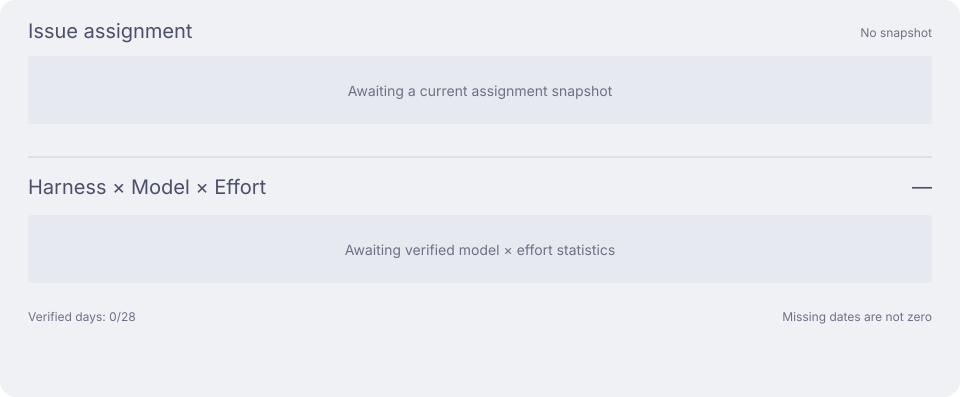
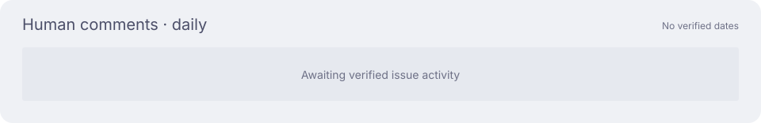

<h1 align="center">Aether Ledger</h1>

  The AI compute ledger of the <strong>Nightglass Protocol</strong> —
  an anonymized, continuously updated record of how my coding agents spend tokens.

  English · <a href="README_zh-CN.md">简体中文</a>

  
  
  

> [!IMPORTANT]
> Public by design. The ledger keeps anonymized aggregates only — no prompts, sessions,
> repository names, hostnames, usernames, or working directories are ever recorded.

Work and personal tasks become issues in Multica. I dispatch them to agents configured as
**harness × model × effort**. This ledger tracks those combinations and the compute they use.

## Activity

Full history across all environments. Tokens include cache reads; costs are API-equivalent estimates.

## Work

### Task assignment and compute

Current issue assignments are grouped by harness. Token bars show **harness × model × effort**
on common verified dates, using one scale. Assignment and usage cover different time windows.

### Task progress

Watch for sustained changes in human participation. Comments include clarification and decisions,
not just corrections. The distribution counts retained lifetime comments on current issues;
parent, child and standalone tasks have different ages and responsibilities.

Work trends: tokens, execution amplification and workflow returns

More runs per triggering comment can prompt a check of dispatch and runtime conditions.
Review returns can prompt a check of task scope. Neither is a quality or failure score.
Each chart uses its own scale; a missing day or absent ratio denominator is marked with a dash.

Personal: assignment, compute and task progress

Personal uses its own machine's snapshots and verified dates, with the same definitions as Work.

New statistics begin at their effective dates; missing collection is never counted as zero.
Chat share and per-issue tokens are omitted until reliable aggregates exist.

[Metric definitions and historical panels](docs/dashboard-details.md) · [Issue activity](docs/issue-activity.md)

## Documentation

> **Before upgrading a writer:** install and verify the [compatible ccusage runtime](docs/operations.md#ccusage-runtime-upgrade) on every writing device. Otherwise, all ccusage-backed collection stops, not only Astra. Existing data is retained.

| Guide | Covers |
|---|---|
| [Operations](docs/operations.md) | Setup, machine identity, branch lifecycle, schemas, dashboards, and recovery |
| [Repository guidance](AGENTS.md) | The contribution and hand-off contract |

## License

MIT — see [LICENSE](LICENSE).
