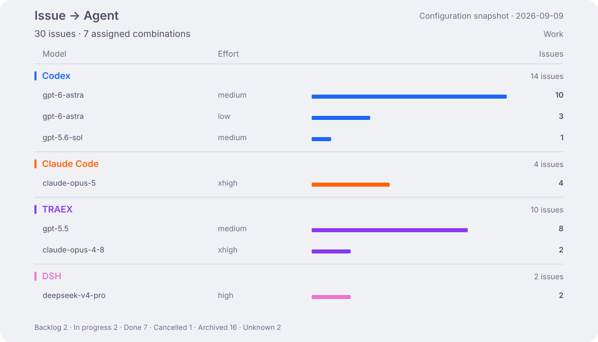

<h1 align="center">Aether Ledger</h1>

  The AI compute ledger of the <strong>Nightglass Protocol</strong> —
  an anonymized, continuously updated record of how my coding agents spend tokens.

  English · <a href="README_zh-CN.md">简体中文</a>

  
  
  

> [!IMPORTANT]
> Public by design. The ledger keeps anonymized aggregates only — no prompts, sessions,
> repository names, hostnames, usernames, or working directories are ever recorded.

Work and personal tasks become issues in Multica. I dispatch them to agents configured as
**harness × model × effort**. This ledger tracks those combinations and the compute they use.

## Activity

Token use includes cache reads. Costs are API-equivalent estimates, not subscription bills.

## Issue allocation

One group per harness, showing only configurations with assigned issues. Identical model/effort
configurations are combined. Counts include all issue states in the current snapshot; currently
only Work is collected. This is current assignment, not historical execution attribution.

## Model allocation & change

Each model row compares the previous and latest 28 days. Harness colors stay the same across
both charts; solid bars represent Work and light bars Personal. Issue bars share one scale; usage bars share a scale within each harness
across both periods. Only combinations observed in either period are shown; New means no prior-period
usage was recorded. The usage view covers Work and Personal; the heatmap also includes legacy
environments.

Usage includes direct and Multica execution. Model and effort are still separate in historical
aggregates, so these tokens are not attributed to the agent configurations above.

[Model history, effort, Fast, quota, and metric definitions](docs/dashboard-details.md)

## Documentation

> **Before upgrading a writer:** install and verify the [compatible ccusage runtime](docs/operations.md#ccusage-runtime-upgrade) on every writing device. Otherwise, all ccusage-backed collection stops, not only Astra. Existing data is retained.

| Guide | Covers |
|---|---|
| [Operations](docs/operations.md) | Setup, machine identity, branch lifecycle, schemas, dashboards, and recovery |
| [Repository guidance](AGENTS.md) | The contribution and hand-off contract |

## License

MIT — see [LICENSE](LICENSE).
