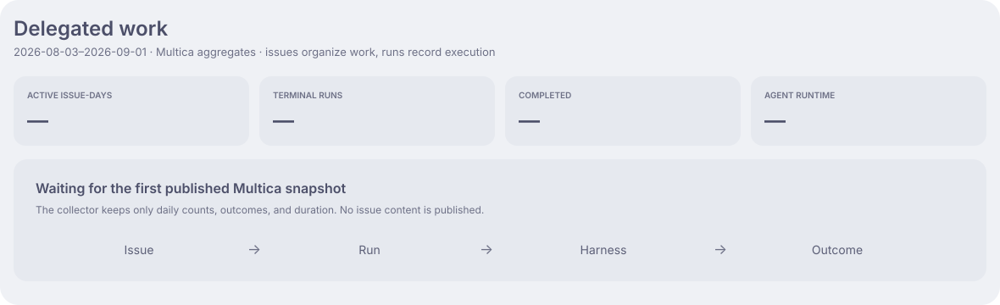
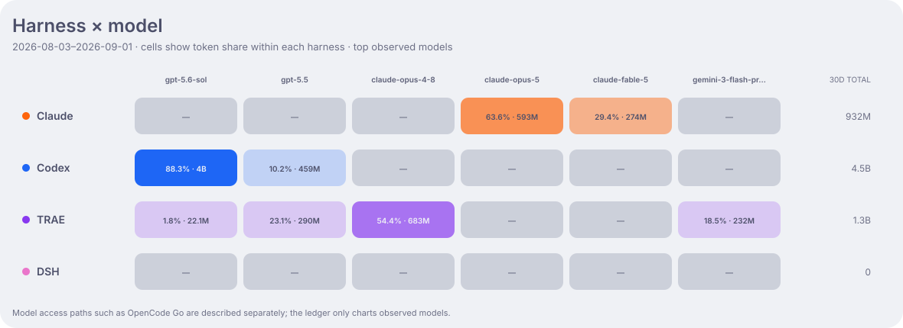
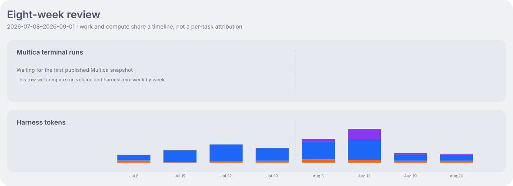

<h1 align="center">Aether Ledger</h1>

<p align="center">
  A public ledger for how I delegate work to coding agents.<br>
  <sub>Part of the <strong>Nightglass Protocol</strong>.</sub>
</p>

<p align="center">
  English · <a href="README_zh-CN.md">简体中文</a>
</p>

<p align="center">
  <a href="https://github.com/kyriekevin/Aether_Ledger/actions/workflows/verify.yml"></a>
  <a href="LICENSE"></a>
  
</p>

> [!IMPORTANT]
> This repository publishes anonymous aggregates only. It never records prompts, issue titles,
> session identifiers, repository names, hostnames, usernames, or working directories.

Most of my agent work now starts in Multica. An issue keeps the work and its context in one place;
each run records which harness took it, how it ended, and how long it ran. This replaces a workflow
that was spread across separate terminals, histories, and task states.

Aether Ledger keeps two records side by side:

- the **work record** comes from Multica issues and runs;
- the **compute record** comes from the local session logs of Claude Code, Codex, TRAE CLI, and DSH.

They describe the same working system from different angles, but they are not joined per task. The
ledger does not guess how many tokens a particular issue consumed.

## Delegated work



This view follows work after it has been delegated: issue-days, terminal runs, outcomes, runtime,
and the harnesses that carried those runs. An issue-day is one distinct issue with a terminal run on
that day. Only daily counters are published; issue content stays in Multica.

## Execution



The matrix shows which models were actually used through each harness in the latest 30 days. Claude
Code, Codex, and TRAE are regular execution paths. DSH is also available through Multica, but I use it
mainly as a place to understand and experiment with harness design. Services such as OpenCode Go make
it easy to try additional models through DSH; they are access paths, not harnesses of their own.

Effort, reasoning, speed, and quota remain useful model-call details. They sit below the
harness–model relationship rather than forming another top-level taxonomy.

## Review



The two rows share a weekly clock. The first follows terminal runs reported by Multica; the second
follows tokens observed in local harness logs. Reading them together helps review changes in work and
execution without pretending that the measurements form a per-task attribution.

## Compute footprint


Tokens and API-equivalent cost remain part of the ledger, but they are resource measurements rather
than a score for output or ability. Cost is estimated from captured model usage and is not a
subscription bill.

## How it works

```text
Issue ── Multica ──→ run ──→ Claude Code / Codex / TRAE / DSH
  │                               │
  └─ daily work aggregates        └─ local session aggregates
                 │                │
                 └──── usage/YYYY-MM-DD
                              │  daily rollover after Asia/Shanghai midnight
                              ▼
                            main ── regenerated public dashboards
```

Work may run locally or on remote devboxes reached over SSH. Those machines are execution surfaces,
not a separate kind of work. Direct harness sessions are still collected, but Multica is now the
primary place where work is organized and dispatched.

## Ledger

Public aggregates live under [`data/`](data/). High-frequency updates land on the current
`usage/YYYY-MM-DD` branch; `main` receives a completed day through the rollover workflow. Human
changes go through pull requests gated by `make verify`.

## Documentation

| Guide | Covers |
|---|---|
| [Operations](docs/operations.md) | Collection, schemas, branch lifecycle, dashboards, and recovery |
| [Repository guidance](AGENTS.md) | Contribution and hand-off rules |

## License

MIT — see [LICENSE](LICENSE).
