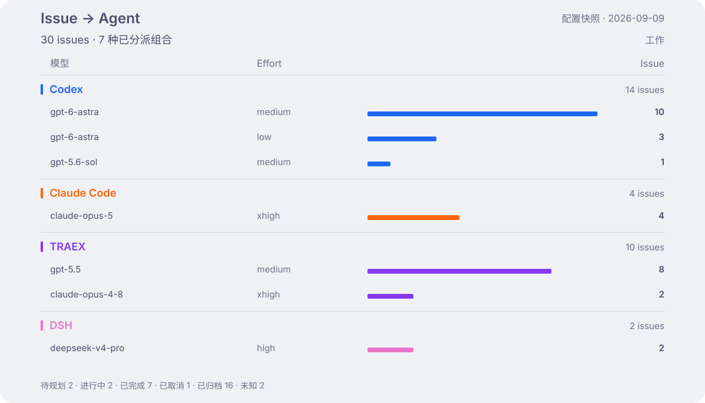

<h1 align="center">Aether Ledger</h1>

  <strong>Nightglass Protocol</strong> 的 AI 算力账本 ——
  持续更新、完全匿名化的 coding agent token 消耗记录。

  <a href="README.md">English</a> · 简体中文

  
  
  

> [!IMPORTANT]
> 本仓库以公开为前提设计。账本只保存匿名化聚合数据——绝不记录提示词、会话、仓库名称、
> 主机名、用户名或工作目录。

工作和个人任务在 Multica 中成为 issue，再派发给按 **harness × model × effort** 配置的 agent。
这份账本记录这些组合，以及实际消耗的算力。

## 活动

Token 包含缓存读取；金额是 API 等价成本估算，并非订阅账单。

## Issue 分派

每个 harness 一组，只展示已分派 issue 的配置，相同 model/effort 组合合并。数量包含当前快照
中的全部 issue 状态，目前仅采集工作环境。这是当前分派，不是历史执行归因。

## 模型分配与变化

每行模型并排比较前 28 天与近 28 天。两张图中 harness 颜色一致，实色代表工作，浅色代表个人；
Issue 横条全图同尺，用量横条按 harness 分别缩放、组内前后期同尺。只列任一时期有记录的组合，“新增”表示前期没有记录到用量。
用量图仅含工作和个人，热力图还包含历史环境。

用量包含手动和 Multica 执行。历史汇总仍将 model 与 effort 分开保存，因此这些 token 没有
归到上面的具体 agent 配置。

[模型历史、effort、Fast、额度与指标口径](docs/dashboard-details_zh-CN.md)

## 文档导航

> **更新写入设备前：**每台设备都必须安装并验证[兼容的 ccusage 运行器](docs/operations_zh-CN.md#ccusage-runtime-upgrade)。否则所有依赖 ccusage 的新增采集都会停止，不仅是 Astra；已有数据会保留。

| 指南 | 内容 |
|---|---|
| [运维文档](docs/operations_zh-CN.md) | 安装、机器身份、分支生命周期、数据结构、面板与恢复 |
| [仓库约定](AGENTS.md) | 贡献与交付约定 |

## License

MIT —— 见 [LICENSE](LICENSE)。
