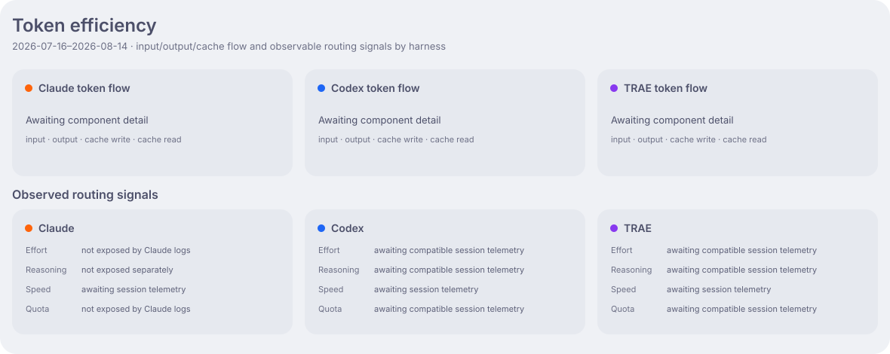

<h1 align="center">Aether Ledger</h1>

<p align="center">
  <strong>Nightglass Protocol</strong> 的 AI 算力账本 ——
  持续更新、完全匿名化的 coding agent token 消耗记录。
</p>

<p align="center">
  <a href="README.md">English</a> · 简体中文
</p>

<p align="center">
  <a href="https://github.com/kyriekevin/Aether_Ledger/actions/workflows/verify.yml"></a>
  <a href="LICENSE"></a>
  
</p>

> [!IMPORTANT]
> 本仓库以公开为前提设计。账本只保存匿名化聚合数据——绝不记录提示词、会话、仓库名称、
> 主机名、用户名或工作目录。

Aether Ledger 记录我如何使用 Claude Code、Codex 与 TRAE CLI，并让这些活动清晰可见。
历史上经 OpenCode 启动的用量仍保留在账本中，但统一归入 Legacy harness。
Token 不是技能点，而是我把想法转化为有价值成果时所投入的算力资源。

## 活动


金额是根据已记录模型用量估算的 API 等价成本，并非实际订阅账单。Active days 按所有
token 总量大于零的自然日累计。

## 拓扑


拓扑图展示最近 30 天里各公开环境由哪些活跃 agent 提供算力。`Development` 合并常驻
开发机与按需申请的 GPU trail worker。

## 分配


## 效率



效率图把 input/output/cache token flow 与模型选择分开，并补充可观测路由信号。Effort、
速度和额度只在对应日期确实观测到匿名聚合数据后显示。

## 账本

适合公开的聚合数据统一收敛在 [`data/`](data/) 下，以长期角色（`personal`、`work`、
`devbox`）和匿名的临时 `trail` 节点组织。

## 工作原理

```text
Claude Code · Codex · TRAE CLI
        │  定时同步
        ▼
usage/YYYY-MM-DD ── 当天聚合提交持续写入
        │  Asia/Shanghai 跨日后触发 rollover
        ▼
main ── squash merge 当天数据 + 重新渲染面板
        │
        └─→ 删除已完成分支，创建当天新分支
```

当天用量只写入日期分支；`main` 只接收 rollover workflow 合入的完整天。人工改动一律走
PR，并以 `make verify` 作为交付门槛。

## 文档导航

| 指南 | 内容 |
|---|---|
| [运维文档](docs/operations_zh-CN.md) | 安装、机器身份、分支生命周期、数据结构、面板与恢复 |
| [仓库约定](AGENTS.md) | 贡献与交付约定 |

## License

MIT —— 见 [LICENSE](LICENSE)。
