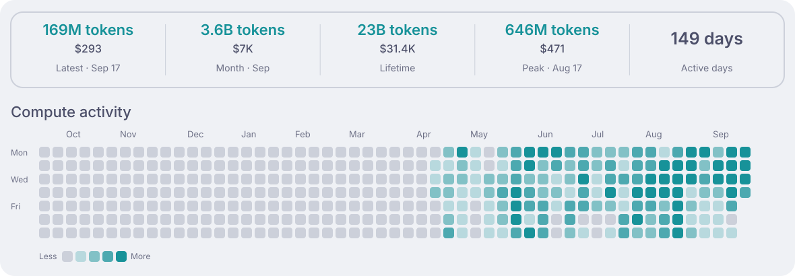
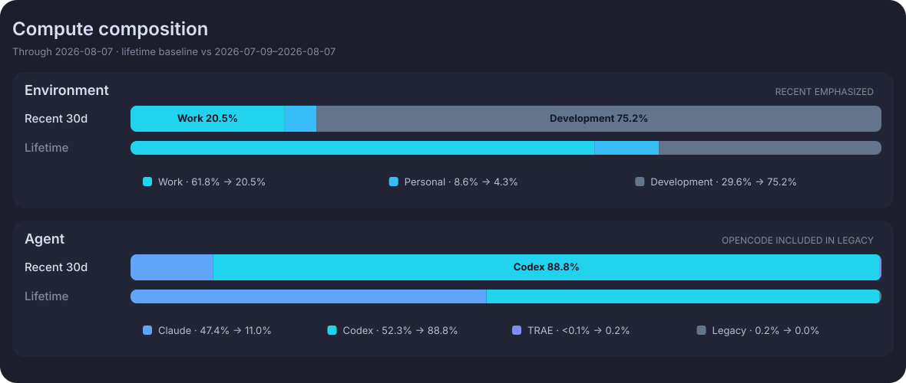
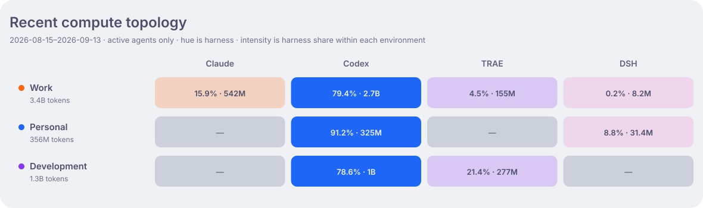

# Aether Ledger

[English](README.md) | [简体中文](README_zh-CN.md)

> **Nightglass Protocol** 的 AI 算力账本。

Aether Ledger 记录我如何使用 Claude Code、Codex 与 TRAE CLI，并让这些活动清晰可见。
历史上经 OpenCode 启动的用量仍保留在账本中，但统一归入 Legacy harness。
Token 不是技能点，而是我把想法转化为有价值成果时所投入的算力资源。

## 活动

金额是根据已记录模型用量估算的 API 等价成本，并非实际订阅账单。Active days 按所有
token 总量大于零的自然日累计。

## 构成

构成图突出最近 30 天相对 Lifetime 基线的变化；拓扑图则单独展示各公开环境角色正在使用的
agent。`Development` 合并常驻开发机与按需申请的 GPU trail worker。

## 账本

适合公开的聚合数据统一收敛在 [`data/`](data/) 下，以长期角色（`personal`、`work`、
`devbox`）和匿名的临时 `trail` 节点组织。仓库不会记录提示词、会话、仓库名称、主机名、
用户名或工作目录。

## 自动化

当天更新持续写入 `usage/YYYY-MM-DD`。Asia/Shanghai 时区跨日后，rollover workflow
会将昨日分支 squash merge 到 `main`，刷新活动面板，并创建当天分支。安装、数据结构与
恢复方法见 [运维文档](docs/operations.zh-CN.md)。
