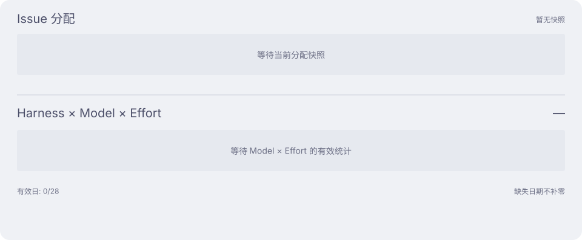

<h1 align="center">Aether Ledger</h1>

  <strong>Nightglass Protocol</strong> 的 AI 算力账本 ——
  持续更新、完全匿名化的 coding agent token 消耗记录。

  <a href="README.md">English</a> · 简体中文

  
  
  

> [!IMPORTANT]
> 本仓库以公开为前提设计。账本只保存匿名化聚合数据——绝不记录提示词、会话、仓库名称、
> 主机名、用户名或工作目录。

工作和个人任务在 Multica 中成为 issue，再派发给按 **harness × model × effort** 配置的 agent。
这份账本记录这些组合，以及实际消耗的算力。

## 使用节奏

保留所有环境的完整历史。Token 包含缓存读取；金额是 API 等价成本估算。

## 工作

### 任务分配与算力

当前 Issue 分配按 harness 合并；Token 横条展示共同有效日期内的 **harness × model × effort**
组合，统一比例尺。任务分配与用量分别标明日期。

### 任务推进

观察人工参与是否持续增加。评论包含澄清、决策与补充，不等于纠错轮次。
分布统计当前 Issue 保留的累计评论；父任务、子任务和独立任务的年龄与职责不同，不能直接比较优劣。

展开工作趋势：Token、执行放大与流程回流

每条触发评论对应更多执行时，可检查派发与运行环境；Review 回流增加时，可检查任务范围。
这些指标不直接代表质量或失败。各图独立比例尺；缺失日期、比值无分母时用短横线标记。

展开个人数据：任务分配、算力与任务推进

个人数据取自个人机器的快照与有效日期，指标口径与工作数据相同。

新统计从各自生效日期开始，漏采不当成零值。Chat 占比、每 Issue Token 暂无可靠汇总，暂不展示。

[指标口径与历史图表](docs/dashboard-details_zh-CN.md) · [Issue 活动统计](docs/issue-activity_zh-CN.md)

## 文档导航

> **更新写入设备前：**每台设备都必须安装并验证[兼容的 ccusage 运行器](docs/operations_zh-CN.md#ccusage-runtime-upgrade)。否则所有依赖 ccusage 的新增采集都会停止，不仅是 Astra；已有数据会保留。

| 指南 | 内容 |
|---|---|
| [运维文档](docs/operations_zh-CN.md) | 安装、机器身份、分支生命周期、数据结构、面板与恢复 |
| [仓库约定](AGENTS.md) | 贡献与交付约定 |

## License

MIT —— 见 [LICENSE](LICENSE)。
