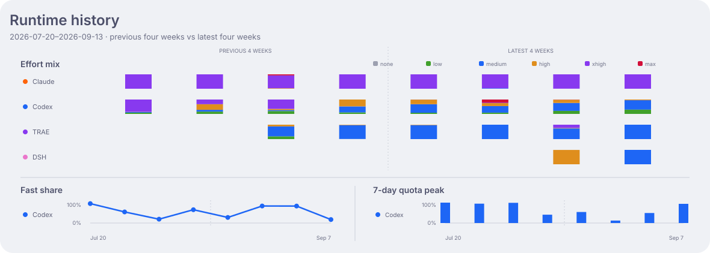

# Dashboard details

[简体中文](dashboard-details_zh-CN.md) · [README](../README.md)

The README follows issues, agent configurations, and actual compute use. The activity heatmap
remains visible. New charts have separate English and Chinese assets; descriptions live in the
README instead of inside the figures.

## Issue allocation snapshot

`uv run --script scripts/multica_dispatch.py` reads the configured Multica workspace and writes
`data/multica-dispatch.json`. It loads the existing local collector configuration and runtime-role
mapping. This is an explicit refresh, not a new scheduled collector. Render afterward with
`uv run --script scripts/render_dashboard.py`; `--check` includes all four new assets.

The collector joins current issue assignees to agents and their runtimes **in memory**, then
publishes only role, harness, normalized model, effort, agent counts, and issue-state counts.
Duplicate issue IDs across pages are counted once. Agent IDs, runtime IDs, issue IDs, names,
prompts, and project information never enter the snapshot. An exact public schema validates
all output and enforces issue conservation, including unassigned/unmapped issues.

The chart groups rows by harness and displays only configurations with assigned issues.
Identical model/effort configurations across roles share one row. Zero-count configurations,
zero-count states, and a zero unassigned count are hidden in the figure but retained in the store.
These are current configurations, not historical execution cohorts. Archived agents remain
in the source snapshot. All visible issues are
counted regardless of date or status. A missing category falls back only to a recognized built-in status, including Archived;
otherwise it remains Unknown. A single issue
is counted once against its current assignee; retries and reassignments are not separately counted.
The snapshot only covers the configured workspace: currently Work, not Personal.

Model normalization removes the known `opencode-go/` provider prefix and `[1m]` context suffix,
and applies the ledger's model aliases. TRAEX effort may be encoded in the model query string;
conflicting query and explicit effort values become Unknown. Missing effort is Default.
Only pricing-catalog models and an explicit list of unpriced public model IDs are retained;
unrecognized model or effort strings become Unknown. This is configuration, not proof that a
particular model actually served a past request. Service tier and context size are not dimensions
of this chart.

## Model allocation and period change

The existing `model-matrix*.svg` asset names now contain grouped horizontal bars, not a sparse
matrix. Every harness appears once. Only combinations observed in the previous or latest
28-day period are rendered. Rows sort by latest use, then previous use; models present only in
the previous period remain visible, so departures are not silently dropped.

Each row has two aligned period bars. Both periods and all model rows within one harness
share a linear scale. Different harness groups scale independently; their printed group totals
preserve the absolute comparison. Issue bars share one scale across the whole dispatch chart.
The newest period ends at the latest positive-token date, or explicit `--as-of`; the earlier
period is the immediately preceding 28 days. New means zero recorded tokens in the earlier
period, not the model's release date. Percentage changes compare recorded amounts; missing
records are not proof of inactivity. Raw logs that still contain joint model/effort observations
can be reprocessed; daily marginal aggregates alone cannot reconstruct that relationship.

Both workflow charts use one shared theme with the activity heatmap and diagnostics, maintained
in `scripts/dashboard_theme.py`. Harness hue is stable between charts. Solid segments represent
Work, lighter segments Personal. A rare devbox segment in dispatch uses still lighter opacity;
it remains separately labelled by the source's covered roles and in segment tooltips. Status
counts are a compact textual summary rather than a second color scheme.

The usage comparison covers Work and Personal, including both direct and Multica execution.
Devbox/trail history is retained in the original activity and diagnostic charts, without being
retroactively assigned to Work. Codex/DSH Multica stores rejoin their original harness; OpenCode
is Legacy. Missing model attribution remains a labelled Unattributed row.

The comparison includes direct and Multica execution. Existing stores keep model and effort in
separate aggregates, so they cannot produce a joint model × effort token breakdown or issue
cost. Historical runs lack an immutable configuration snapshot; current agent settings are
never used to reconstruct historical token attribution. Configuration dates and usage dates
are therefore displayed independently. Tokens measure resources, not quality or productivity.

## Rendering

`scripts/dashboard_story.py` computes the grouped period comparison and renders the two chart types in both
languages. `scripts/render_dashboard.py` manages canonical discovery, dates, atomic writes,
and freshness checks. Daily rollover stages all generated charts together. Neither token stores
nor the existing collection schedule is changed by the chart redesign.

## Diagnostic charts

These retain their existing 30-day/eight-week windows and metric definitions in
[Operations](operations.md#dashboard). Their time windows differ from the README overview.

### Activity history

### Environment and harness history

The older environment view includes devbox/trail as Development.

### Model allocation

### Runtime configuration

